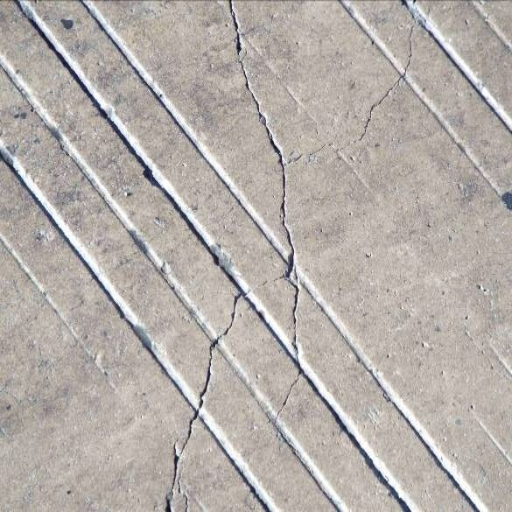
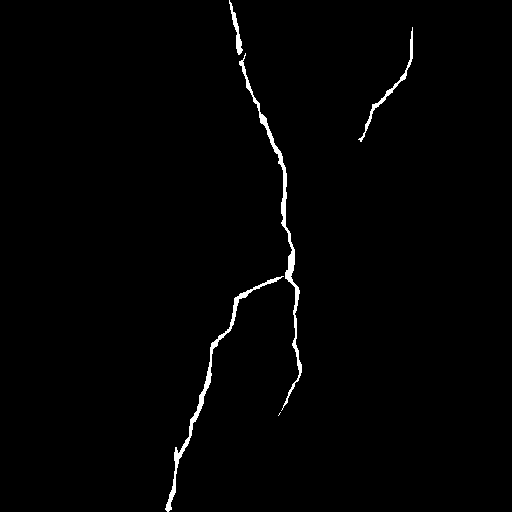
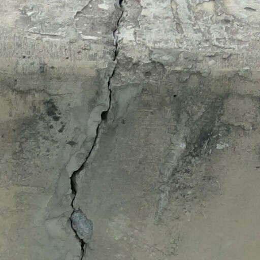
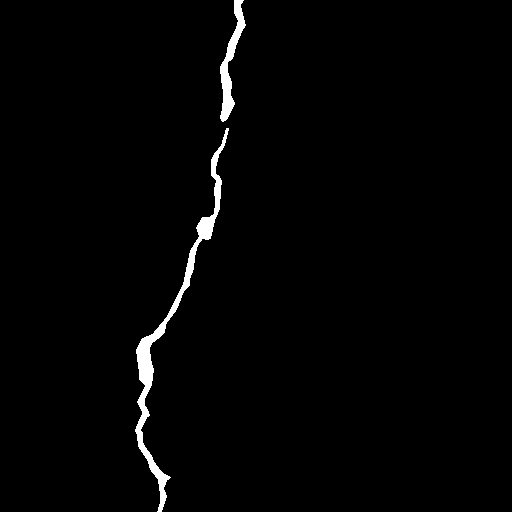
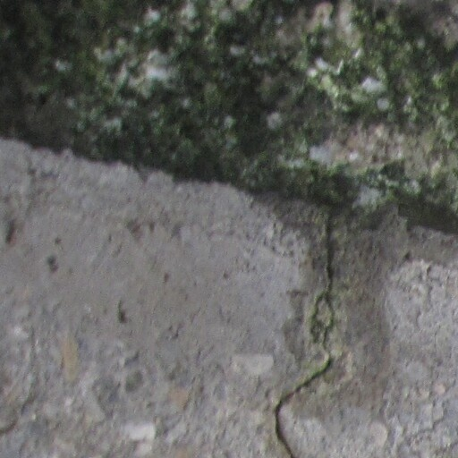
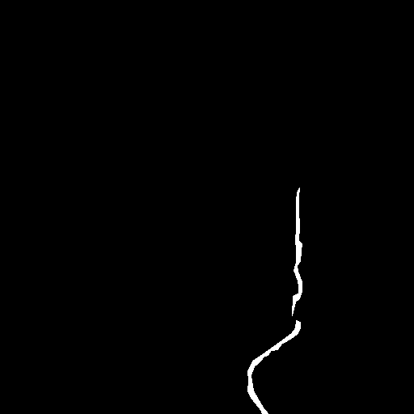

# BCID: Bridge Crack Image Dataset 🌉


---

## 📖 Introduction
**BCID** is a self-constructed and meticulously annotated semantic segmentation dataset specifically designed for surface cracks in concrete bridges. The images were collected from real-world bridge inspection reports during routine maintenance operations, capturing cracks under diverse and realistic field conditions (e.g., complex concrete textures, and varying lighting).

Accurate crack segmentation is a prerequisite for reliable geometric quantification (length and width). This dataset aims to provide a robust benchmark for evaluating pixel-level crack detection algorithms.

## 📊 Dataset Statistics
* **Total Images:** 2,092 high-resolution image patches.
* **Image Resolution:** 512 × 512 pixels.
* **Annotation Type:** Pixel-level binary masks for semantic segmentation (Crack vs. Background).
* **Data Split:** The dataset is divided into training, validation, and test sets using a strict **8:1:1** ratio.

## 📁 Repository Structure (Upcoming)
Upon release, the repository will be organized as follows:

```text
BCID_Dataset/
├── train/
│   ├── images/          # Training images (1673 files)
│   └── masks/           # Pixel-level annotations (1673 files)
├── val/
│   ├── images/          # Validation images (209 files)
│   └── masks/           # Pixel-level annotations (209 files)
└── test/
    ├── images/          # Test images (210 files)
    └── masks/           # Pixel-level annotations (210 files)
```

## 🖼️ Sample Previews
*Here are a few examples demonstrating the diversity of the concrete backgrounds and the high fidelity of our manual annotations.*

| Original Image | Ground Truth Mask |
| :---: | :---: |
|  |  |
|  |  |
|  |  |

*(Note: The full dataset and explicitly defined split files will be uploaded upon the acceptance of our manuscript.)*
